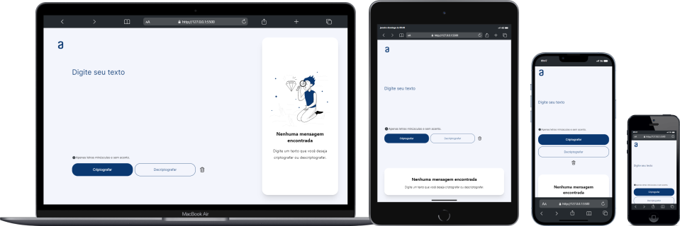

  
  
  

# Alura Challenge - encoder/decoder

Olá a todos, sejam muito bem vindos ao projeto **Alura Challenge - encoder/decoder**. Aqui você encontra um programa de [de]codificação de mensagens, ideal para compartilhar informações e conversar com os amigos(as). Eae, achou interessante? Vem conhecer!

  

## 🔨 Funcionalidade

A funcionalidade básica desse projeto fazer o *encoder/decoder* de mensagens de texto. Para isso, o usuário entra com uma mensagem e escolhe por meio de botões se quer codificar ou decodificar, e por fim aparece o resultado em um modal, onde é possível realizar a cópia para área de transferência.

  

Também o projeto conta um um `dark theme` feito utilizando as classes utilitárias do tailwind, que detecta o tema configurado como padrão do navegador. O uso dessa classe é similar as demais do tailwind, podendo aninhar classes e modificadores trazendo um resultado bem rico e tudo direto no html.

  

  

## 🚀 Técnicas e tecnologias utilizadas

  

  

A estilização base foi pensada primeiro no mobile por se tratar de um break point menor é mais assertivo.

  

Em javascript houve a delegação de tarefas para cada arquivo, isso serve para deixar o código mais funcional e melhorar na manutenção.

  

Os arquivos ficaram com mais linhas do que necesssário pois o objetivo é deixar o código legível e menos suceptível a erros nas regras de negócio.

  

Quero deixar um adendo aqui para o arquivo `modify-attributes-svg.js`. Ele foi pensado unicamente melhorar o processo de codificação e deixar menos *poluido* a área de trabalho.

## 📁 Clonar repositório

Clone este repositório via Bash, usando:

  

✅ HTTPS:

~~~~ bash

git  clone  https://github.com/SamColt36/alura-challenge-encoder-decoder

~~~~

✅ SSH:

~~~~ bash

git  clone  git@github.com:SamColt36/alura-challenge-encoder-decoder

~~~~

✅ GitHub CLI:

~~~~ bash

gh  repo  clone  SamColt36/alura-challenge-encoder-decoder

~~~~

✅ Download ZIP.

  

## 🌐 Acessar o projeto

O projeto encontra-se finalizado.

[Em breve veja o deploy por aqui](https://samcolt36.github.io/alura-challenge-encoder-decoder/)🔗

  

## 🛠️ Abrir e rodar

O projeto encontra-se finalizado.

  

## 👥 Contribuições

Contribuições são bem-vindas! Sinta-se à vontade para enviar pull requests ou relatar problemas.

  

## 📄 Licença

Este projeto está licenciado sob a Licença MIT. Consulte o arquivo LICENSE para obter detalhes.